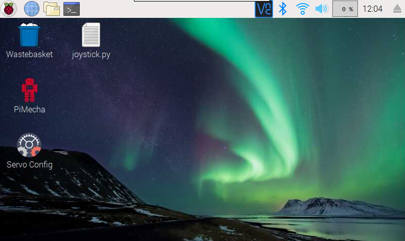
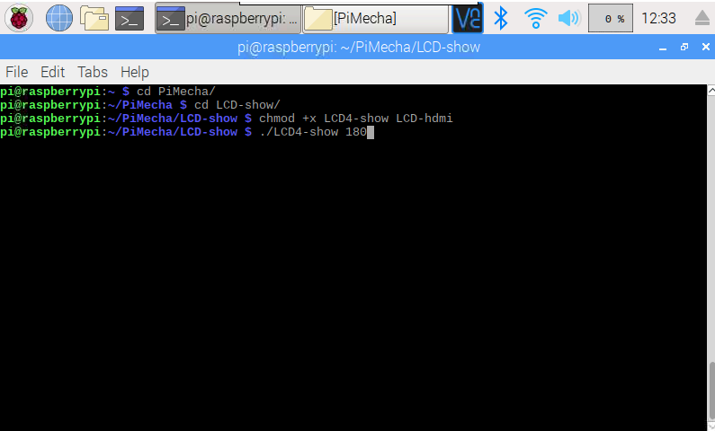

# PiMecha
PiMecha is a Raspberry Pi Humanoid Robot with 17 DOF

**Steps for PiMecha software installation:**
1. Open Terminal and download the code by writing:
```git clone https://github.com/sbcshop/PiMecha.git```

2. Your code will be downloaded to '/home/pi' directory. Use 'ls' command to check the list of directories.

3. Go to directory 'PiMecha' and run the command to change the permissions of 'configGUI' and 'controlGUI' python files:
   ```
   sudo chmod +x configGUI.py controlGUI.py
   ```
   You are now able to run these two softwares for your PiMecha. The control software is to control the movements of PiMecha, while the config software is to config the servo motor.

4. Click on the 'Servo Config' shortcut icon to configure your motor, or if you wish to give movements to PiMecha or control it, click on the 'PiMecha' shortcut icon.

5. You can also move these 2 icons to your desktop for your convinience.


# PiMecha with LCD
One of the variants of PiMecha has a LCD mounted on its chest. You can configure this screen using few simple steps.

**Steps for LCD configuration**
1. Open terminal and go to the PiMecha directory and type
```cd LCD-show
chmod +x LCD4-show LCD-hdmi
```

2. Now you would require to rotate your screen to the viuewing angle. Write

```./LCD4-show 180```

After you enter this command, your system will ask you for reboot. Enter 'y' and reboot your Pi.

3. While your system is rebooting, you will have to connect the HDMI and MicroUSB Cable.

Note: In case you see your screen resolutions distorted, you just have to press the on/off button the the LCD screen at its back. This will restore its resolution then.

If you wish to return back to the HDMI, enter

```./LCD-hdmi```
<p align="center">
</p>

# PiMecha Tutorial links

**Servo Config**
<p align="center">
<a href="http://www.youtube.com/watch?feature=player_embedded&v=QBY8_OcnnSg" target="_blank"></a>
</p>

**PiMecha Control Software**
<p align="center">
<a href="http://www.youtube.com/watch?feature=player_embedded&v=Spr0D8LX27g" target="_blank">

</a>
   </p>


# Buy Link

SB Shop <a href="https://shop.sb-components.co.uk/search?type=product&q=pimecha" target="_blank">https://shop.sb-components.co.uk/search?type=product&q=pimecha</a>
